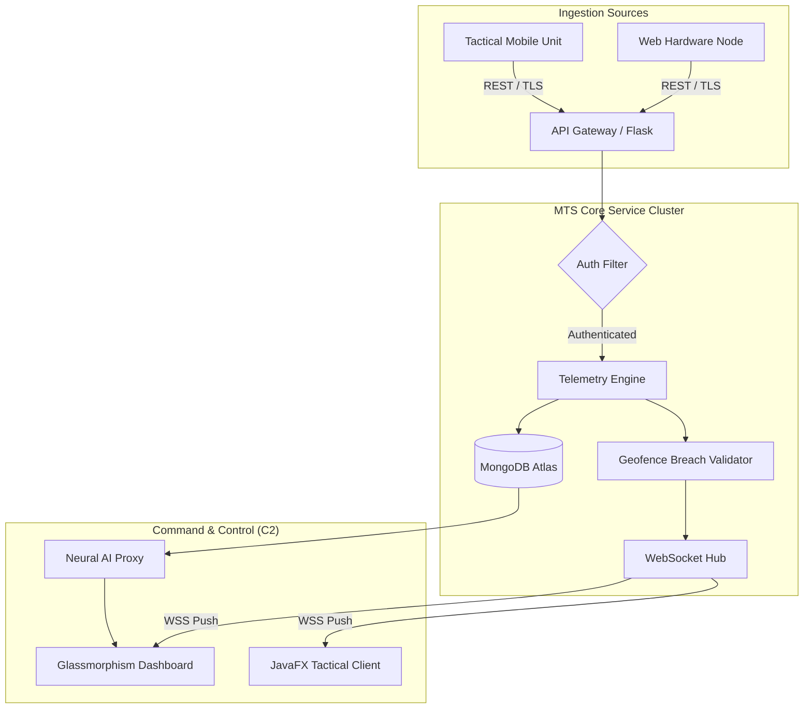

# MTS CORE TRACKER: MOBILE TRACKING SYSTEM
## Official Enterprise Technical Documentation & Operational Manual


---

## TABLE OF CONTENTS
1. [Executive Summary & Introduction](#1-executive-summary--introduction)
2. [System Architecture & Engineering](#2-system-architecture--engineering)
3. [Security Infrastructure & Authentication](#3-security-infrastructure--authentication)
4. [Database & Persistence Layer](#4-database--persistence-layer)
5. [API Reference & Technical Specifications](#5-api-reference--technical-specifications)
6. [Frontend & UI/UX Engineering](#6-frontend--uiux-engineering)
7. [Operational Workflows](#7-operational-workflows)
8. [Environment Setup & Installation](#8-environment-setup--installation)
9. [Deployment & DevOps Strategy](#9-deployment--devops-strategy)
10. [Maintenance, Troubleshooting & Support](#10-maintenance-troubleshooting--support)

---

## 1. EXECUTIVE SUMMARY & INTRODUCTION

### 1.1 Overview
The **MTS CORE TRACKER** is an enterprise-grade **Mobile Tracking System (MTS)** and mission telemetry platform engineered for real-time asset monitoring and cybersecurity threat detection. It provides a "Single Pane of Glass" view for tracking thousands of concurrent mobile hardware nodes with sub-second latency.

### 1.2 Core Objectives
- **Precision Mobile Tracking**: Sub-meter accuracy via WGS 84 coordinate normalization for mobile assets.
- **Real-Time Responsiveness**: Event-driven architecture using WebSockets for instantaneous mobile data propagation.
- **Threat Intelligence**: Integrated AI for tactical mobile movement analysis and automated geofence breach detection.
- **Enterprise Security**: Zero-Trust security model with JWT session management and hardware-level API key isolation for mobile devices.

### 1.3 Scope of Application
Designed for high-stakes mobile asset tracking, corporate logistics, military-grade mission monitoring, and advanced cybersecurity operations centers (SOC).

### 1.4 Technology Stack
MTS is built on a modern, high-performance stack designed for low-latency data processing and high visual fidelity.

| Component | Technology | Role |
|-----------|------------|------|
| **Backend** | Python 3.10+ / Flask | Core Microservice & API Gateway |
| **Real-time** | WebSockets (flask-sock) | Event-driven telemetry broadcasting |
| **Database** | MongoDB Atlas | Global NoSQL persistence with Geospatial indexing |
| **Frontend** | Vanilla JS / CSS3 | High-performance Glassmorphism Web Dashboard |
| **Desktop** | Java 17+ / JavaFX | Dedicated Tactical Monitoring Client |
| **AI Engine** | Groq Cloud (Mixtral) | LLM-driven neural telemetry analysis |
| **Auth** | JWT / RSA-256 | Cryptographically secure session management |

---

## 2. SYSTEM ARCHITECTURE & ENGINEERING

### 2.1 High-Level Architecture
MTS utilizes a **Decoupled Triad Architecture**, separating the ingestion logic from the presentation and persistence layers.



### 2.2 Telemetry Engine Logic
The core engine processes incoming GPS data through a multi-stage pipeline:
1. **Validation**: Casting coordinates to 64-bit floats and verifying ownership bindings.
2. **Persistence**: Time-series logging into the `locations` collection.
3. **Validation**: Haversine distance computation against all active geofences for that device ID.
4. **Broadcast**: Instantaneous routing of the telemetry payload to all active WebSocket clients assigned to the device owner.

---

## 3. SECURITY INFRASTRUCTURE & AUTHENTICATION

### 3.1 Operator Identity Management
Authentication is governed by **RSA-256 signed JSON Web Tokens (JWT)**. 
- **Session Duration**: 2 Hours (Standard Enterprise Policy).
- **Password Security**: PBKDF2-HMAC-SHA256 hashing with 29,000 iterations via the `passlib` library.

### 3.2 Hardware Node Security
Tracked devices communicate via **Static API Keys**.
- **Entropy**: Keys are generated using `secrets.token_urlsafe(32)`.
- **Authorization**: The `X-API-KEY` header is required for all ingestion endpoints, cross-referenced against the device owner in the `devices` collection.

### 3.3 The Vault Subsystem
A specialized data persistence layer designed for immutable logs and security-sensitive metadata.
- **Modules**: `analytics`, `threats`, `logs`, `config`.
- **Governance**: Only users with an active JWT session can query or write to their respective vault modules.

---

## 4. DATABASE & PERSISTENCE LAYER

### 4.1 Schema Overview (MongoDB Atlas)
| Collection | Primary Purpose | Key Fields |
|------------|-----------------|------------|
| `users` | Identity Store | `username`, `password` (hashed) |
| `devices` | Hardware Registry | `device_id`, `api_key`, `owner` |
| `locations` | Telemetry History | `device_id`, `latitude`, `longitude`, `timestamp` |
| `geofences` | Spatial Constraints | `device_id`, `radius_meters`, `is_inside` |
| `vault_*` | Secure Data Store | `owner`, `data` (encrypted), `created_at` |

### 4.2 Optimization Strategies
- **Geospatial Indexing**: Compound indices on `device_id` and `timestamp` for O(1) retrieval of the latest state.
- **Sharding Ready**: Partitioning strategy based on `device_id` for horizontal scaling.

---

## 5. API REFERENCE & TECHNICAL SPECIFICATIONS

### 5.1 REST Endpoints
| Verb | Endpoint | Security | Description |
|------|----------|----------|-------------|
| POST | `/auth/login` | None | Operator authentication and JWT issuance. |
| POST | `/devices/register` | JWT | Node provisioning and API key generation. |
| POST | `/location` | JWT / API Key | Primary telemetry ingestion point. |
| GET | `/alerts` | JWT | Fetch historical breach and system alerts. |
| POST | `/proxy/groq` | JWT | Tactical AI analysis proxy. |

### 5.2 WebSocket Protocol (WSS)
The system maintains persistent links at `ws://<host>/ws?token=<JWT>`.
- **Events**: `location_updated`, `geofence_alert`, `pong`.

---

## 6. FRONTEND & UI/UX ENGINEERING

### 6.1 Glassmorphism Design System
The web dashboard is engineered for high-stakes monitoring:
- **Aesthetic**: Dark-mode palette with `backdrop-filter: blur(15px)` overlays.
- **Telemetry Display**: Monospaced typography for high-density coordinate data.
- **Performance**: Throttled DOM updates via `requestAnimationFrame` to maintain 60FPS during high-load streams.

### 6.2 JavaFX Tactical Client
A desktop-native application designed for stationary command centers:
- **Async Processing**: Uses Java's `java.net.http.HttpClient` for non-blocking API interactions.
- **Hardware Registry**: Real-time listing and selection of tracked assets.

---

## 7. OPERATIONAL WORKFLOWS

### 7.1 Mission Initialization
1. Register operator account.
2. Provision target devices and retrieve API keys.
3. Configure geofence parameters (Center Point + Radius).

### 7.2 Neural Scan Workflow
1. Select active device.
2. Trigger "Neural Analysis".
3. The system proxies current telemetry to the **Groq Mixtral-8x7b** engine.
4. AI returns a tactical summary and movement intent prediction.

---

## 8. ENVIRONMENT SETUP & INSTALLATION

### 8.1 Backend Provisioning
1. **Runtime Isolation**: Create a Python virtual environment to prevent dependency conflicts.
   ```bash
   python -m venv venv
   source venv/bin/activate  # Linux/macOS
   .\venv\Scripts\activate   # Windows
   ```
2. **Dependency Ingestion**: Install the core library suite.
   ```bash
   pip install -r backend/requirements.txt
   ```
3. **Database Initialization**: 
   - Deploy a MongoDB Atlas Cluster (M0 Free Tier or higher).
   - Create a database named `gps_tracking`.
   - Whitelist the deployment IP in the Atlas Network Access panel.

### 8.2 Environment Configuration
Create a `.env` file in the `backend/` directory with the following strategic parameters:

| Variable | Requirement | Strategic Purpose |
|----------|-------------|-------------------|
| `MONGODB_URI` | Mandatory | Primary connection string for the Atlas cluster. |
| `JWT_SECRET_KEY` | Mandatory | High-entropy string used for RSA-256 token signing. |
| `GROQ_API_KEY` | Mandatory | Neural engine access for AI tactical analysis. |
| `SYSTEM_IPV4` | Optional | Used for auto-discovery by the Java Tactical Client. |

### 8.3 Java Tactical Client Setup
1. **JDK Requirement**: Ensure Java 17 or higher is installed.
2. **Build System**: The client uses Maven for dependency management.
   ```bash
   cd java-dashboard
   mvn clean install
   mvn javafx:run
   ```

### 8.4 Launch Sequence
1. Start the Backend API: `python backend/app.py`
2. Access the Web Dashboard: Open `frontend/index.html` in a modern browser.
3. (Optional) Initialize Java Monitor: Execute the `GPSDashboard` binary.

---

## 9. DEPLOYMENT & DEVOPS STRATEGY

### 9.1 Containerization & Hosting
- **Heroku/Render**: Production deployment using the provided `Procfile`.
- **Docker**: (Optional) Multi-stage builds for backend and frontend isolation.

### 9.2 Performance Metrics
- **Ingestion Delay**: < 150ms.
- **Socket Uptime**: 99.9% target.
- **AI Latency**: < 1.5s per tactical summary.

---

## 10. MAINTENANCE, TROUBLESHOOTING & SUPPORT

### 10.1 Logging Subsystem
Logs are bifurcated into **Operational Logs** (standard output) and **Audit Logs** (persisted in `vault_logs`).

### 10.2 Troubleshooting Matrix
| Issue | Potential Cause | Resolution |
|-------|-----------------|------------|
| WebSocket Disconnect | Token Expiration | Re-authenticate at `/auth/login`. |
| 403 Access Denied | Invalid API Key | Re-link device or check `X-API-KEY` header. |
| AI Neural Timeout | Groq API Rate Limit | Check API quota or retry in 60s. |

### 10.3 Health Checks
Monitor `GET /health` for real-time heartbeat and timestamp verification.

---
**END OF OFFICIAL DOCUMENTATION // MTS CORE RELEASE 4.0.0**
