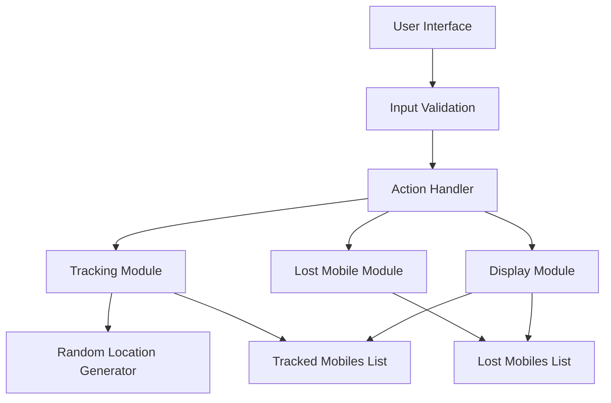

# 📱 Mobile Tracking System (Java AWT)

A simple **Java AWT–based desktop application** that simulates mobile number tracking and lost mobile reporting. The system provides a graphical interface to track mobile locations, report lost devices, and display stored data using in-memory lists.

---

## ✨ Features

* 📍 Simulated mobile location tracking (latitude & longitude)
* 🚨 Lost mobile reporting
* 📊 Display of tracked and lost mobile numbers
* 🖥️ User-friendly AWT GUI
* 🔐 API key validation (simulated)
* ❌ Exit confirmation dialog

---

## 🧠 Concepts Used

* Java AWT (GUI components)
* Event handling (`ActionListener`, `WindowAdapter`)
* Object-Oriented Programming
* Collections (`ArrayList`)
* Input validation using Regular Expressions

---

## 🛠️ Tech Stack

* **Language:** Java
* **GUI Framework:** AWT
* **Utilities:**

  * java.util.Random
  * java.util.ArrayList
  * javax.swing.JOptionPane

---

## 📂 Project Structure

```
mobile-tracking-system/
│
├── Godfrey.java   # Main application file
└── README.md      # Project documentation
```

---

## ⚙️ How It Works

* The user enters a 10-digit mobile number.
* On tracking, the system validates the API key and generates random coordinates.
* Lost mobiles are stored separately for reference.
* All data is maintained temporarily using in-memory lists.

---

## 🚀 How to Run

### 1️⃣ Compile the Program

```bash
javac Godfrey.java
```

### 2️⃣ Run the Application

```bash
java Godfrey
```

---

## 🏗️ System Architecture



### Architecture Description

The application follows an event-driven architecture. User actions from the AWT interface trigger handlers that validate input and route requests to tracking, reporting, or display modules. Data is stored temporarily using in-memory lists.

---

## ⚠️ Limitations

* Location tracking is simulated (not real-time GPS)
* No database or persistent storage
* API key validation is hardcoded

---

## 🔮 Future Enhancements

* Integration with real tracking APIs
* Database support for persistent storage
* Improved UI using Swing or JavaFX
* Authentication and role-based access

---

## 📜 License

This project is licensed under the **MIT License**.

---

## 🌟 Author

Developed as an academic Java GUI project demonstrating **AWT and event handling**.

Give the repository a ⭐ if you find it useful.
