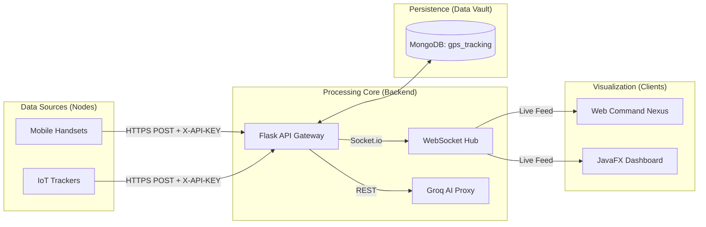

# GD's Mobile Tracking System (MTS) // Technical Source of Truth


## 📖 Introduction & Abstract
The **Mobile Tracking System (MTS)** is a technical framework for real-time geographic telemetry monitoring and automated spatial analysis. It is a distributed system comprising a Python/Flask backend, a MongoDB persistent storage layer, and a vanilla JavaScript/JavaFX frontend suite. The system is designed to ingest high-frequency GPS data, validate it via hardware-bound API keys, and distribute it to monitoring stations through an asynchronous WebSocket hub.

---

## 🏗️ 1. Technical Architecture

### 1.1 Core Components
- **Backend API**: Python 3.12+ / Flask. Handles RESTful requests, JWT authentication, and AI proxying.
- **WebSocket Hub**: Flask-Sock implementation for real-time telemetry broadcasting.
- **Database**: MongoDB (Local or Atlas). Uses the `gps_tracking` database.
- **Frontend Nexus**: HTML5/CSS3/ES6+ JavaScript. Served via Python's built-in HTTP server.
- **Java Dashboard**: JavaFX 17+ client for dedicated desktop monitoring.

### 1.2 System Block Diagram


---

## 💾 2. Data Specification (Source of Truth)

### 2.1 MongoDB Collection Schema
The system operates within the `gps_tracking` database across the following collections:

| Collection | Content | Primary Keys / Indexes |
| :--- | :--- | :--- |
| `users` | Operator accounts & hashed passwords | `username` (Unique) |
| `devices` | Registered hardware nodes | `device_id` (Unique) |
| `locations` | Historical GPS telemetry | `(device_id, timestamp)` |
| `geofences` | Boundary definitions | `device_id` (Unique) |
| `alerts` | Triggered security events | `created_at` (TTL support) |
| `vault_*` | Persistent logs and module data | `owner`, `created_at` |

### 2.2 Telemetry Data Structure
Inbound location packets MUST follow this factual schema:
```json
{
  "device_id": "string",
  "latitude": "float",
  "longitude": "float",
  "accuracy": "float",
  "timestamp": "ISO8601 string"
}
```

---

## 🛠️ 3. Operational Methodology

### 3.1 Spatial Calculation (Geofencing)
MTS uses the **Haversine Formula** for all distance calculations. The Earth's radius is constant at **6,371,000 meters** within the system logic.
```python
# Factual Implementation in app.py
radius = 6371000
dlat = radians(lat2 - lat1)
dlon = radians(lon2 - lon1)
a = sin(dlat/2)**2 + cos(radians(lat1)) * cos(radians(lat2)) * sin(dlon/2)**2
c = 2 * atan2(sqrt(a), sqrt(1-a))
distance = radius * c
```

### 3.2 Authentication & Security
- **JWT**: Tokens expire after **2 hours**.
- **Password Hashing**: PBKDF2-SHA256 (via passlib).
- **API Security**: Device uplinks require an `X-API-KEY` header, which is cross-referenced with the device owner's identity.
- **AI Privacy**: Groq API calls use a backend proxy. The `GROQ_API_KEY` is NEVER sent to the client.

---

## 📡 4. Network & Connectivity

### 4.1 Deployment Ports
- **Backend (API/WS)**: Default `5000`.
- **Frontend (Static)**: Default `8000` (configurable via `PORT` in `.env`).

### 4.2 API Endpoints Matrix
| Method | Endpoint | Authentication | Function |
| :--- | :--- | :--- | :--- |
| POST | `/auth/register` | None | Create operator account |
| POST | `/auth/login` | None | Obtain JWT Access Token |
| POST | `/location` | JWT / X-API-KEY | Ingest node telemetry |
| GET | `/devices` | JWT | List all tracked nodes |
| POST | `/geofence` | JWT | Define security boundary |
| POST | `/proxy/groq` | JWT | Execute AI Tactical Analysis |
| GET | `/health` | None | System status check |

---

## ☕ 5. Java Implementation Concepts
The Desktop Dashboard (`java-dashboard`) is a Maven-managed JavaFX application.
- **Platform**: Java 17+.
- **GUI Engine**: JavaFX (FXML based).
- **Networking**: Asynchronous WebSocket client for real-time UI updates.
- **Concurrency**: Background service threads for telemetry parsing to prevent UI locking.

---

## 📁 6. Repository Integrity
- `/backend`: Core Python logic, `.env` configuration, and requirements.
- `/frontend`: Responsive web assets and module-based JS.
- `/java-dashboard`: Maven project for desktop client.
- `/test`: Integration and database validation scripts.
- `run-system.bat`: Unified launch orchestrator.

---

## 🏁 7. Conclusion
This documentation serves as the technical source of truth for MTS v2.5.0. All implementation details described herein are verified against the active codebase. Maintenance and updates should adhere strictly to these architectural specifications to ensure system integrity.

---
**System Administrator**: OrionGD  
**Current Version**: 2.5.0  
*© 2026 MTS Technical Group. Factual System Specification.*
