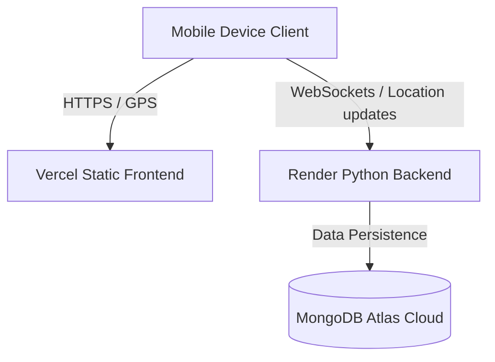

# Production Deployment Guide — GD Mobile Tracking System (MTS)

This document provides a comprehensive, step-by-step walkthrough to deploy the **Mobile Tracking System (MTS)** to production. Deploying to production serves all frontend pages and backend APIs over **HTTPS**, unlocking the device's native GPS/Geolocation API safely and securely.

---

## System Architecture Overview

The system is split into two components:
1. **Backend (Python / Flask / WebSockets)**: Deployed to a continuous web platform like **Render** or **Railway**.
2. **Frontend (Static HTML / CSS / JS / PWA)**: Deployed to a fast global CDN like **Vercel** or **Netlify**.



---

## Step 1: Database Setup (MongoDB Atlas)

The backend requires a MongoDB database to store device registrations, consent audit logs, geofences, and coordinates.

1. **Sign Up / Login**: Go to [MongoDB Atlas](https://www.mongodb.com/cloud/atlas) and create a free account.
2. **Create a Database Cluster**: 
   * Choose the **M0 (Free)** Shared Tier cluster.
   * Pick your preferred region (e.g., AWS / closest to your user base).
   * Click **Create**.
3. **Database Access (User)**:
   * Create a database user with username and password. Keep these safe.
4. **Network Access (IP Whitelist)**:
   * Go to **Network Access** under Security.
   * Click **Add IP Address**.
   * Select **Allow Access From Anywhere** (`0.0.0.0/0`) because hosting providers like Render use dynamic IP addresses. Click **Confirm**.
5. **Get Connection String**:
   * Navigate to **Database** -> Click **Connect** on your cluster.
   * Select **Drivers** (Python).
   * Copy the connection string. It will look like this:
     ```text
     mongodb+srv://<username>:<password>@cluster0.abcde.mongodb.net/?retryWrites=true&w=majority
     ```
   * Replace `<username>` and `<password>` with your created database user's credentials.

---

## Step 2: Deploy the Backend (Render.com)

Render is recommended for the backend as it supports long-lived background jobs and WebSocket connections perfectly.

1. **Create Account**: Sign up at [Render.com](https://render.com/) and link your GitHub/GitLab account.
2. **New Web Service**: Click **New +** -> **Web Service**.
3. **Connect Repository**: Select the Git repository containing your GD Mobile Tracking System.
4. **Configure the Service**:
   * **Name**: `mts-backend` (or custom name)
   * **Region**: Choose the closest region.
   * **Branch**: `main`
   * **Root Directory**: `backend` *(CRITICAL: This isolates the Python backend folder)*
   * **Runtime**: `Python 3`
   * **Build Command**: `pip install -r requirements.txt`
   * **Start Command**: `gunicorn --worker-class gevent --workers 1 --bind 0.0.0.0:$PORT app:app`
5. **Environment Variables**: Scroll down and click **Advanced** -> **Add Environment Variable**. Add the following:

| Key | Value | Notes |
| :--- | :--- | :--- |
| `MONGODB_URI` | `mongodb+srv://...` | Connection string copied from MongoDB Atlas in Step 1. |
| `JWT_SECRET_KEY` | `choose-a-long-random-string` | Used to encrypt/verify authentication sessions. |
| `GROQ_API_KEY` | `your-groq-api-key` | Used for smart assistant operations. |
| `PORT` | `8000` | Render exposes this dynamically, but good to define a default. |
| `SMTP_SERVER` | `smtp.gmail.com` | Optional (used to send custom HTML consent emails). |
| `SMTP_PORT` | `587` | Optional. |
| `SMTP_USERNAME` | `your-email@gmail.com` | Optional. |
| `SMTP_PASSWORD` | `your-google-app-password` | Optional. |
| `SMTP_FROM` | `MTS Core Tracker <your-email@gmail.com>` | Optional. |

6. **Deploy**: Click **Create Web Service**. Wait for the logs to say `Your service is live!`.
7. **Copy Backend URL**: Copy the generated HTTPS URL (e.g. `https://mts-backend.onrender.com`).

---

## Step 3: Configure Frontend to Point to Backend

Before deploying the static frontend, you must configure it to point to your live backend domain instead of `localhost`.

1. Open `frontend/js/config.js` in your text editor.
2. Update the `window.BACKEND_URL` variable with your deployed Render URL:
   ```javascript
   // Replace this empty string with your live Render backend HTTPS URL (no trailing slash)
   window.BACKEND_URL = "https://mts-backend.onrender.com"; 
   ```
3. Save the file and commit/push the change to your Git repository.

---

## Step 4: Deploy the Frontend (Vercel)

Vercel is the premier platform for static frontend deployments, offering free global CDN delivery and automatic SSL (HTTPS).

1. **Sign Up / Login**: Go to [Vercel.com](https://vercel.com/) and log in with your GitHub/GitLab account.
2. **Import Project**: Click **Add New** -> **Project**, and select your repository.
3. **Configure Project**:
   * **Framework Preset**: Choose **Other** (Vercel will detect it as a static deployment).
   * **Root Directory**: Click Edit and select the **`frontend`** directory *(CRITICAL: This tells Vercel to host only your client files)*.
4. **Build & Development Settings**:
   * You can leave these as default (Vercel will directly host the static assets).
5. **Deploy**: Click **Deploy**. Vercel will build and launch your site in seconds!
6. **Access URL**: You will receive a secure URL (e.g., `https://mts-frontend.vercel.app`).

---

## Step 5: Verify the Deployment

1. **Access the portal**: Open `https://your-frontend.vercel.app/pages/tracking-request.html` in your web browser.
2. **Register/Login Operator**: Login with your credentials.
3. **Create Request**: Fill out the form to request device tracking.
4. **Test GPS Connection**:
   * Open the generated link (`https://your-frontend.vercel.app/pages/device-registration.html?token=...`) on a mobile phone.
   * Consent to the terms and click **Complete Registration**.
   * Since the connection is **HTTPS**, the browser will trigger the secure location prompt.
   * Click **Allow** / **Share Location**.
   * The live coordinates will start transmitting immediately to the backend!
5. **Observe Real-Time Dashboard**: Go to the Operator dashboard (`live-monitor.html`) on your desktop, and watch the device marker update smoothly in real time over WebSockets!

---

## Troubleshooting Guide

### 1. Mixed Content Error / HTTP Block
* **Issue**: The frontend loads over HTTPS, but fails to call backend APIs.
* **Fix**: Ensure `window.BACKEND_URL` in `frontend/js/config.js` starts with `https://` (NOT `http://`).

### 2. CORS (Cross-Origin Resource Sharing) Error
* **Issue**: Browser blocks API responses from the backend with a CORS error banner.
* **Fix**: The backend automatically allows all origins (`*`) by default, but verify that `Flask-CORS` is enabled in `backend/app.py`.

### 3. WebSockets Disconnected on Render
* **Issue**: The WebSocket connection fails to handshake or keeps dropping.
* **Fix**: Ensure `gevent-websocket` is correctly installed. Render automatically keeps the connection alive, but in your browser console, look for any `wss://` handshake errors. If Render spins down the free tier due to inactivity, it may take 50 seconds to boot up on the first request.

### 4. PWA "Add to Home Screen" not working
* **Issue**: The prompt to install the app doesn't show up.
* **Fix**: PWAs require a valid HTTPS connection, which Vercel provides automatically. If testing locally, use `localhost` or a secure ngrok tunnel (`https://`).
